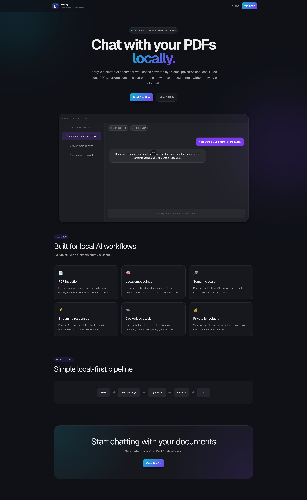
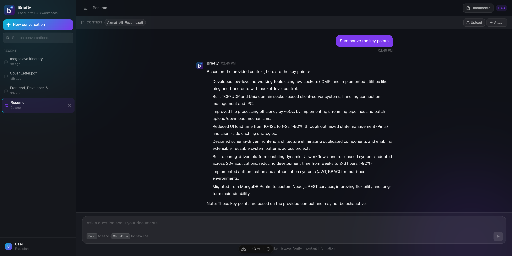
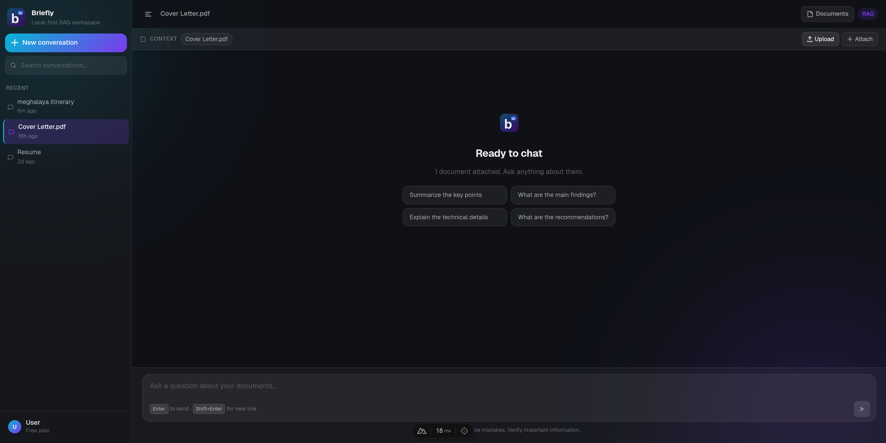
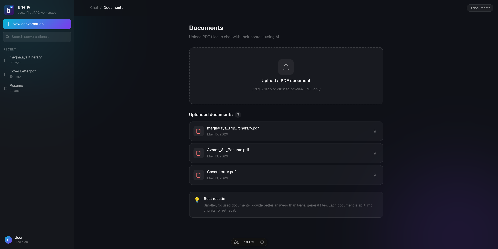
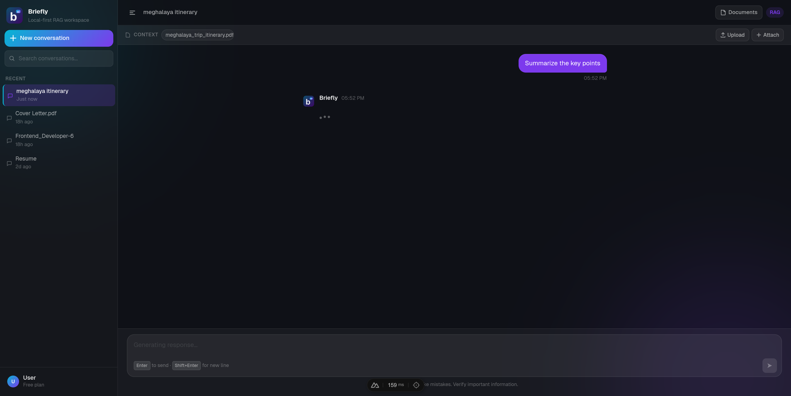

# ✨ Briefly

> Self-hosted conversational RAG workspace for chatting with PDFs using local
> LLMs.

Briefly is a local-first AI document chat application powered by Ollama,
PostgreSQL + pgvector, and a fully Dockerized infrastructure.

It allows users to upload PDFs, generate embeddings locally, perform semantic
search, and chat with documents using Retrieval-Augmented Generation (RAG).

---



---

## 🚀 Features

- 📄 PDF upload & text extraction
- ✂️ Automatic document chunking
- 🧠 Local embeddings with Ollama
- 🔎 Semantic vector search using pgvector
- 💬 Conversational AI chat
- ⚡ Streaming AI responses
- 🗂️ Persistent conversation history
- 🐳 Fully Dockerized infrastructure
- 🔒 Local-first architecture (no cloud AI required)

---

## 🧱 Tech Stack

### Frontend

- Nuxt 4
- Nuxt UI v4
- Tailwind CSS v4
- TypeScript

### Backend

- Node.js
- Express
- Prisma ORM
- PostgreSQL
- pgvector
- Ollama

### AI / RAG Pipeline

- Local LLM inference
- Embedding generation
- Vector similarity search
- Retrieval-Augmented Generation (RAG)

---

## 🏗️ Architecture

```txt
Frontend (Nuxt)
        ↓
Backend API (Express)
        ↓
PostgreSQL + pgvector

Backend
        ↓
Ollama (Local LLM Runtime)
```

---

## 🖼️ Screenshots

### 💬 Chat Interface





---

### 📚 Documents



---

### ⚡ Streaming Responses



---

## ⚙️ Getting Started

### 1️⃣ Clone Repository

```bash
git clone https://github.com/AzzVipe/briefly.git

cd briefly
```

---

### 2️⃣ Install Ollama

Download and install Ollama:

https://ollama.com

---

### 3️⃣ Pull Required Models

```bash
ollama pull llama3

ollama pull nomic-embed-text
```

---

### 4️⃣ Configure Ollama For Docker Access (Linux)

Create override directory:

```bash
sudo mkdir -p /etc/systemd/system/ollama.service.d
```

Create override file:

```bash
sudo nano /etc/systemd/system/ollama.service.d/override.conf
```

Add:

```ini
[Service]
Environment="OLLAMA_HOST=0.0.0.0:11434"
```

Reload systemd and restart Ollama:

```bash
sudo systemctl daemon-reload

sudo systemctl restart ollama
```

---

### 5️⃣ Create Environment Files

Backend:

```bash
cp backend/.env.example backend/.env
```

Frontend:

```bash
cp frontend/.env.example frontend/.env
```

---

### 6️⃣ Start Application

```bash
docker compose up --build
```

Frontend:

```txt
http://localhost:3000
```

Backend API:

```txt
http://localhost:5000
```

---

## 🔧 Environment Variables

### Backend

```env
PORT=5000
DATABASE_URL=
OLLAMA_BASE_URL=
CHAT_MODEL=
EMBED_MODEL=
CHUNK_SIZE=
CHUNK_OVERLAP=
TOP_K=
SIMILARITY_THRESHOLD=
```

### Frontend

```env
NUXT_PUBLIC_API_BASE=
```

---

## 📁 Project Structure

```txt
briefly/
├── backend/
├── frontend/
├── docker/
├── docker-compose.yml
├── README.md
└── LICENSE
```

---

## 🛣️ Future Improvements

- 📌 Source citations UI
- 📝 Better markdown rendering
- 🧠 Semantic reranking
- ✂️ Smarter chunking strategies
- 🔐 Authentication
- 👥 Multi-user workspaces

---

## 📜 License

MIT License
